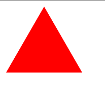

# 🎇 CSS Shapes - Triangle
I have completed Day 29 challenge in #30DaysOfHtmlCss.

## Description
CSS Shapes - Triangle refers to the ability to create triangular shapes using CSS. It allows you to define geometric shapes like triangles without the need for additional markup or images. This feature is often used to create arrows, pointers, or decorative elements in web design. CSS Shapes are achieved using the clip-path property, but browser support may vary. 

## 🖼️ Example Image
